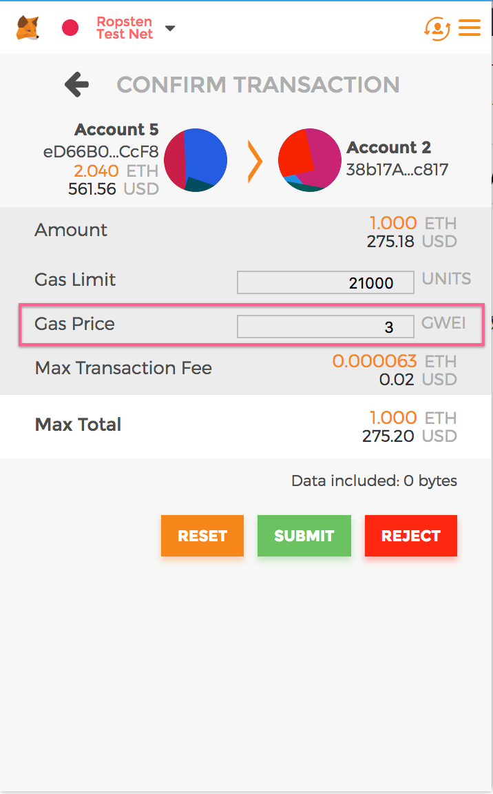

## Explaining Gas

### The EVM

The Ethereum Virtual Machine (EVM) is a part of the software running the Ethereum protocol. This EVM is what executes smart contracts on every node in the network. This execution is not free for the miners/nodes because they spend a lot of money on electricity to do this. Therefore for each transaction, a small amount of "gas" is needed to compensate the miners who end up processing your transaction. 

### Gas
Gas is the unit of cost to successfully execute a transaction onto the Ethereum blockchain. Certain functions automatically assigned fixed values in gas and the total amount of gas required to execute a transaction is calculated in this way. 

For example:

- To simply send one transaction ($ from A to B) it costs 21000 gas
- To compare two integers it costs 3 gas
- To create a new contract it costs 32,000 gas
- To save 1 MB to storage (31250 256-bit words) it costs 625000000 gas!

It is also important to note the units of Ether. The smallest unit of either is Wei, where 1000000000000000000 Wei equal 1 Ether. 

Gas cost varies with the traffic of the network. Currently at the time of writing this (8/22/18) - the current minimum gas cost is 3.7 Gwei. Where 1 Gwei is one billionth of 1 Ether. So for example, to send one transaction at 21000 gas, where each gas unit costs 3.7 Gwei and at the current ether price of $277 - the transaction will cost roughly $0.21. 

### Gas Limit vs Gas Price

When sending a transaction through a tool like MetaMask you have the option to change the values of Gas Limit and Gas Price. 

Gas Limit - This is how much gas you are willing to add to the transaction. Usually the estimate provided is sufficient but you can add or subtract depending on your wishes. A more detailed approach is in the Altering Gas Limit section. 

Gas Price/Cost - This is the cost in GWei of each gas unit used in a transaction. This cost is set by the congestion of the network and varies. Altering it can be beneficial for some transations and this is explained in the Altering Gas Price section. 

### Altering Gas Limit

Again the gas limit of a transaction is automatically estimated in tools like MetaMask. In the below picture we are referencing one of the transactions we used above ($ from A to B)

We have the option to send less gas than the estimate but if the gas provided is less than what is actually needed, we lose the gas we gave and the transaction fails. 

If we send more gas than what is needed in the transaction - the remainder is refunded to us.

We can increase the gas limit like so:

We can see in the above images how increasing the gas limit increases the transaction fee. In this case anything unused will be refunded back to us. That is not the case when altering gas price. 

#### Altering Gas Price

For the most part, if we are not in a rush to process our transaction, we can usually leave the gas price at the amount that was estimated. 

Alternatively, say we are in a rush because we are trying to send money to a website to buy tickets before anybody else!

In this case, we can increase the gas price we are willing to pay. Here the amount of gas used will remain the same but the amount you pay for it will increase. This higher transaction cost ultimately persuades miners to execute your transaction before others on the network and therefore increases the speed of the transaction. In this case the extra money spent goes to the miner and is not refunded to the user. 

Example here:

 