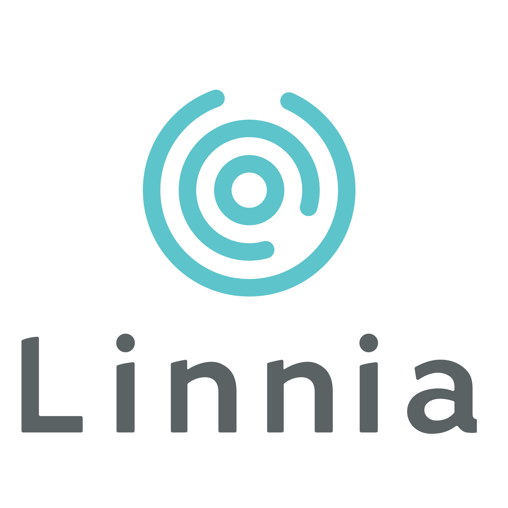

This repository acts as your gateway into all things Linnia. Here, you can find libraries and components written in JavaScript that you can use to build your own Linnia-powered applications.

If you have any questions about how the protocol works or how to get started, this repository also contains documentation to steer you in the right direction.

## What is Linnia?

[Linnia](https://consensys.github.io/linnia-homepage/) is a decentralized protocol that facilitates the secure storage and sharing of sensitive data.

[Introduction Video](https://www.youtube.com/watch?v=w0VskCpUKZ8)

[Overview Blog Post](https://medium.com/linnia/linnia-f4f139a795ef)

Want to take a deeper dive into what the Linnia Protocol is and what it stands for? Check out our [whitepaper](/introducing-linnia.pdf) or our [homepage](https://consensys.github.io/linnia-homepage/) for more context.

## Metadata

For every record, Linnia protocol stores Metadata. This Metadata is chosen by the provider or whoever upload the record. The Metadata is completly public and the [Linnia Server](https://github.com/ConsenSys/linnia-server) can be used to query the Metadata of the records in order to find specific data. In order to have the data more organized and easy to search we provide specifications on how to write Metadata for you records. Go [HERE](METADATA.md) to check the specs.

## Public Repositories

#### Components

| Repository                                                                    | Description                                                        |
| ----------------------------------------------------------------------------- | ------------------------------------------------------------------ |
| [Linnia Smart Contracts](https://github.com/ConsenSys/Linnia-Smart-Contracts) | Home of the Linnia Protocol Smart Contracts                        |
| [Linnia Box](https://github.com/ConsenSys/linnia-box)                         | React UI Starter Template that integrates smart contracts and IPFS |
| [Linnia JSON File Generator](https://github.com/ConsenSys/linnia-json-file-generator) | Tool to help you generate fake data to upload when testing |

#### Libraries

| Repository                                                                         | NPM                                                                                                                                                     | Description                                     |
| ---------------------------------------------------------------------------------- | ------------------------------------------------------------------------------------------------------------------------------------------------------- | ----------------------------------------------- |
| [Linnia Smart Contracts ABIs](https://github.com/ConsenSys/Linnia-Smart-Contracts) |  | ABIs for the Linnia Smart Contracts             |
| [Linnia JS](https://github.com/ConsenSys/linnia-js)                                |                             | JS Library to interact with the Linnia protocol |

## Setting up a development environment

Getting started building blockchain technology is tough! As with any emerging technology, the tooling and documentation surrounding it is hard to grasp. But don't worry, we have you covered! Please consult our [starter guide](./GETTING_STARTED.md) to learn everything you need to get started!

## Ethereum learning resources

[Ethereum resources](ETHEREUM.md)

## Contributing

Linnia prides itself on being an open source protocol. We greatly appreciate any contributions you can make to further the cause. Please reference our [contribution documentation](./CONTRIBUTING.md) before getting started!

## What Keys Linnia Uses?

Go [HERE](KEYS.md) to read more about encryption patterns and how the Linnia Protocol uses them.

## What is gas and how does it apply to transactions?

Go [HERE](GAS.md) to to understand how gas works and how to use it in your Ethereum transactions.
